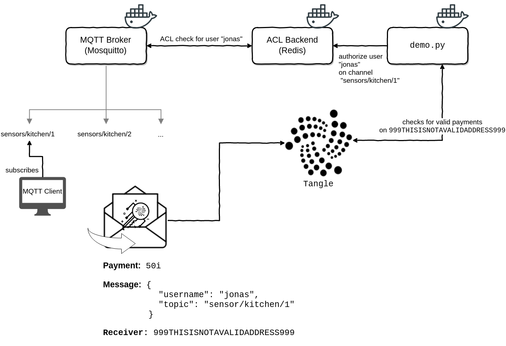

# IOTA-DEMO-PYTHON

This is a small demo application that searches for incoming transactions on a
given IOTA address and authorizes a user to receive data on a MQTT broker,
depending on the payload of the transaction.

## TL;DR: How to start the demo

1. Install `docker` and `docker-compose` for your OS from [here](https://docs.docker.com/compose/install/).
2. Clone (`git clone https://github.com/joWeiss/iota-demo-python.git`) or
   [download](https://github.com/joWeiss/iota-demo-python/archive/master.zip) this repo.
3. Open the folder in a terminal and start the services with `docker-compose up`.

## Setup

The main parts for this demo are the `demo.py` application and the `mosquitto`
broker. The `redis` container only serves as a backend for the authorization of
clients connecting to the `mosquitto` broker.



### The Publisher

To publish messages on the broker, a client has to connect with valid credentials, i.e. the credentials have to be
stored in the ACL backend prior to a connection. It may be useful to define publishers as _superusers_ in
`mosquitto.conf`, e.g.:

```bash
# in mosquitto.conf
auth_opt_superusers raspi_1
```

For the purpose of this demo, the redis container is initialized with a superuser **admin** and the password
**mysupersecretpassword**. See `clients/publisher.sh` for a dummy script that connects end sends the current date every
second.

### The Subscriber

To connect and subscribe to topics on the broker, the user has to send a valid payment to the provided IOTA wallet
address prior to any connection attempt. The transaction value has to be a multiple of `VALUE_PER_TEN_SECONDS` and has
to carry a message in JSON format like this:

```json
{"username": "jonas", "topic": "mytopic"}
```

This allows the user to connect to the broker, e.g.:

```bash
#!/bin/bash
$ mosquitto_sub --username jonas --password jonas-mytopic --topic mytopic
```

The `clients/subscriber.sh` script is an example for a client that tries to connect to the broker of this demo.

## Configuration

You can configure the following settings:

- in `docker-compose.yml`:
    - `IOTA_NODE`: The iota node to connect to (Default: https://potato.iotasalad.org:14265)
    - `REDIS_HOST`: The redis-backend for the ACL (Default: redis)
    - `VALUE_PER_TEN_SECONDS`: The amount of IOTA (i) that enables 10 seconds of access (Default: 1)
- as an environment variable:
    - `ADDRESS`: The receiving IOTA address for payments (Required)

To allow unconfirmed transactions to be processed, add the flag `--allow-unconfirmed` to the `command` field in `docker-compose.yml`:

```yml
services:
  iota:
    ...
    command: ["--allow-unconfirmed", "$ADDRESS"]
```

### Advanced

The following table (from the [github.com/jpmens/mosquitto-auth-plug] page) shows the different kinds of backends that
can be employed with this setup:

[github.com/jpmens/mosquitto-auth-plug]: https://github.com/jpmens/mosquitto-auth-plug#introduction

| Capability                 | mysql | redis | cdb   | sqlite | ldap | psk | postgres | http | jwt | MongoDB | Files |
| -------------------------- | :---: | :---: | :---: | :---:  | :-:  | :-: | :------: | :--: | :-: | :-----: | :----:
| authentication             |   Y   |   Y   |   Y   |   Y    |  Y   |  Y  |    Y     |  Y   |  Y  |  Y      | Y
| superusers                 |   Y   |       |       |        |      |  3  |    Y     |  Y   |  Y  |  Y      | N
| acl checking               |   Y   |   1   |   2   |   2    |      |  3  |    Y     |  Y   |  Y  |  Y      | Y
| static superusers          |   Y   |   Y   |   Y   |   Y    |      |  3  |    Y     |  Y   |  Y  |  Y      | Y

 1. Topic wildcards (+/#) are not supported
 2. Currently not implemented; back-end returns TRUE
 3. Dependent on the database used by PSK

---

If you like the demo and you want to buy me a coffee/beer/drink/whatever, I'm thankful for all donations.

IOTA: QQAVKVQSIBFLQMWDZYMERZIMMT99Y9YSWRWZHLTCDMRWHPEDULQHPMZAMVSPRJJ9POIOJRZIUMVIECXC9AVVDWOWKD

BTC: bc1qsswmasrc3jlhr2z562jlqjyw4cvu8kpu2ju704

BTC (segwit): 393xkxrFuvC4h6o3Y6sPXbwuBdrTqBfxZw

